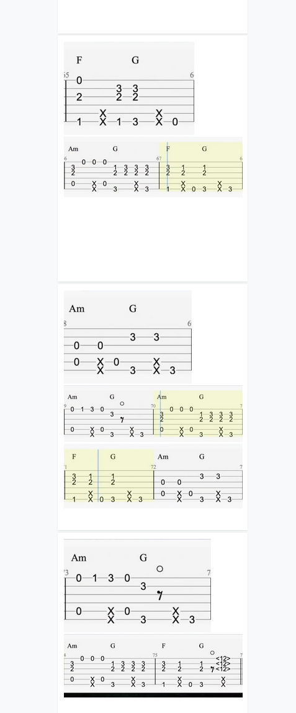
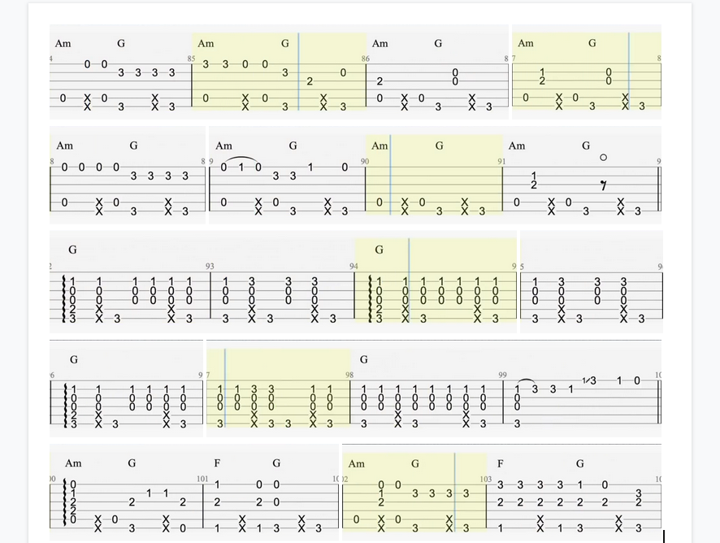

# normalizeImageWidth
## Description
A small Google App Script for normalizing image widths in a document for each line

This was used to help speed up the process of screenshotting guitar tabs from youtube videos, and composite them into one document

## Example:
### Pre-normalized


Before running the script, pasted images have different kind of sizes due to screenshotting different regions of the sheet music. Each "line" or "paragraph" contains images to form 4 bars. As we can see these images needs to be normalized/fixed such that each line's images have uniform heights and each image's width add up to some target width (which was 752px after some testing)

### Post-normalized


After running the script, we see that each line of images now correctly show the 4 bars, by having their width fixed to match up to the total target width. Lines that have 2 or more images are fixed by calculating the ratio needed to have the same height (and fit the width). This is done by solving a linear equation system of 2+ variables.

```
width_1 * x_1 + width_2 * x_2 + ... + width_n * x_n = targetWidth

height_1 * x_1 - height_2 * x_2 = 0
height_1 * x_1 - height_3 * x_3 = 0
...
height_1 * x_1 - height_n * x_n = 0
```

x_1, x_2, ..., x_n represents the scaling multiplier needed to correctly resize the n images. We equate the sum total widths with the target width, as well as equating the final heights of all images.

We substitute our x_n values by reordering the height equation
```
height_1 * x_1 / height_n = x_n
```

The final solution to these variables can then be solved via substitution:
```
x_1 = targetWidth / (width_1 + (width_2*height_1/height_2) + ... + (width_n*height_1/height_n))

x_2 = height_1 * x_1 / height_2
x_n = height_1 * x_1 / height_n
```

We then can scale all of the images within the same line of our document:
```
imgs[n].setWidth(imgWidths[n] * x_n);
imgs[n].setHeight(imgHeights[n] * x_n);
```